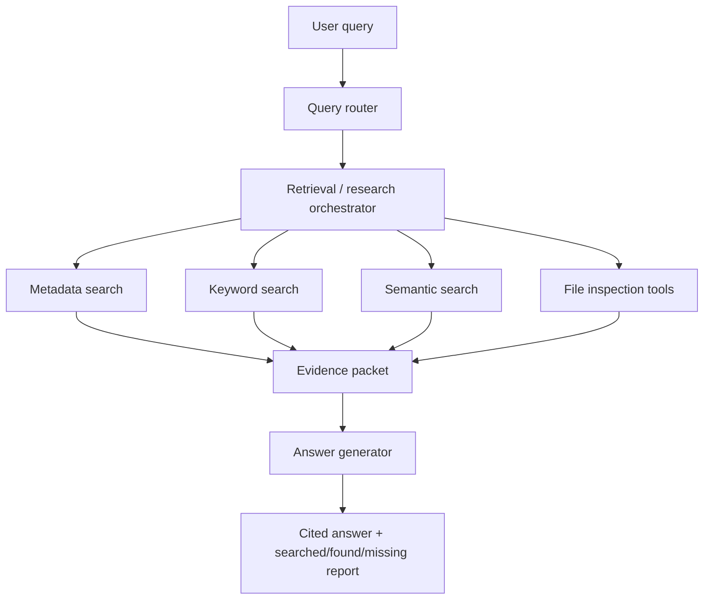

# Project Overview: Uni RAG Agent

## Core Concept

Uni RAG Agent is a local course-archive intelligence system for `D:\Projects\Uni RAG Agent\Courses`. It answers questions from the user's university materials with source-grounded retrieval, explicit search coverage, and citations to the files that support each answer.

The target user is the project owner: a recent graduate with a large mixed archive of course files, assignments, notebooks, code, datasets, slides, reports, and lecture media.

## High-Level Architecture & Flow

The system should not be a generic "chat with a folder" wrapper. It should route the query, search the right course/indexes, build a structured evidence packet, and answer only from that packet.

Core flow:

1. User asks a question.
2. Query router classifies the intent and candidate courses/indexes.
3. Retrieval layer combines metadata, keyword, and semantic search.
4. Research tools inspect exact files/chunks when needed.
5. System builds an evidence packet containing search coverage, sources, evidence, scores, and weaknesses.
6. Answer generator writes only from the evidence packet.
7. If evidence is weak, the system reports what was searched and what was missing.

## In-Scope

* **File inventory**: Inventory every file under `Courses`, including skipped files, with path, course, extension, size, modified time, category, and indexing status.
* **Selective ingestion**: Extract and index text-like course knowledge files such as PDFs, PowerPoints, Word documents, text/Markdown files, notebooks, code, structured data summaries, and existing transcripts.
* **Hybrid retrieval**: Use vector search, keyword/BM25 search, metadata filters, file-name matching, and course-name matching. Merge MVP keyword and semantic results with Reciprocal Rank Fusion (RRF), not a reranker.
* **Evidence packet workflow**: Separate retrieval/research from final answering through a structured, auditable evidence object.
* **Source-grounded answers**: Cite course, file path, source type, and location such as page, slide, notebook cell, row sample, or timestamp where available.
* **Code and notebook inspection**: Search and inspect `.ipynb`, `.py`, `.r`, `.cpp`, `.h`, and `.m` files without automatically executing old course code.
* **Data schema summaries**: Summarize CSV, Excel, JSON/JSONL, SQLite, and DB files through schema/sample metadata rather than embedding full datasets.
* **Exploratory analysis notebooks**: Keep read-only EDA notebooks under `notebooks/` for inspecting generated inventory, extraction, data-summary, indexing, retrieval, answering, and evaluation artifacts where that stage produces useful analysis data. These notebooks analyze app data such as `data/uni_rag.sqlite`, `data/runs/`, and index metadata; they must not mutate `Courses` or execute old course files.
* **Weak retrieval reporting**: Clearly state searched courses, indexes, keywords, semantic queries, evidence found, and missing coverage.

## Out-of-Scope (By Design)

* **Standalone image RAG/OCR by default**: Images are almost entirely data and should be metadata-only. Do not OCR, caption, or semantically index standalone `.png`, `.jpg`, `.jpeg`, `.tif`, or `.jfif` files by default. This does not prohibit the optional scanned-PDF OCR fallback described under document extraction.
* **Full-folder embedding**: Do not blindly embed the whole archive. The folder contains large datasets, model artifacts, installers, archives, media, and binaries that would pollute retrieval.
* **Automatic video/audio transcription**: Videos and audio are metadata-only initially. Existing `.vtt` transcripts can be indexed. Transcription should be opt-in later.
* **Automatic old-code execution**: The agent must not run course scripts, notebooks, installers, or arbitrary code unless the user explicitly approves a specific action.
* **Unsafe artifact loading**: Do not load pickle/joblib/model files such as `.pkl`, `.joblib`, `.pt`, `.tflite`, `.weights`, or large `.bin` files by default.
* **Knowledge graph MVP**: A knowledge graph may be useful later, but the MVP should prioritize accurate inventory, extraction, search, evidence packets, and cited answers.
* **Fancy UI first**: Use operational CLI commands for ingestion/index/eval and a simple FastAPI plus HTML/JS interface for answers. Do not build a polished UI before retrieval quality is proven.

## Technology Stack

* **Language/Platform**: Python `>=3.12`.
* **Package/Dependency Manager**: `uv` for all Python dependency and run workflows.
* **Metadata Store**: SQLite.
* **Keyword Search**: SQLite FTS5 with default unicode61 tokenizer.
* **Vector Store**: ChromaDB with separate collections per logical index (documents, slides, notebooks, code, data schemas, transcripts).
* **Document Extraction**: PyMuPDF for PDFs, with optional Tesseract OCR fallback for scanned PDFs only when `UNI_RAG_OCR_ENABLED` is true and Tesseract is installed; `python-pptx` for PPTX; `python-docx` for DOCX; `nbformat` for notebooks; pandas/openpyxl for tabular summaries.
* **App/API Layer**: FastAPI backend with a simple HTML/JS frontend.
* **LLM Provider**: Multi-provider via LangChain. LLM and embedding providers/models are configuration values loaded from environment variables, with deterministic fake adapters for tests. Do not hardcode a paid or cloud provider as required.
* **Configuration**: Environment variables loaded from a `.env` file via `python-dotenv`.

## Key System Constraints

* Use `uv add package_name` for dependency management and `uv run -m uni_rag_agent ...` for project commands.
* Use pandas-based EDA notebooks as read-only analysis companions for generated app data. Notebooks should document the command that produces their input data, should be updated when the source artifact contract changes, and should avoid adding additional runtime dependencies unless the project explicitly accepts them.
* Keep `Courses` as source data; do not mutate course files during ingestion.
* Store generated metadata, extracted text, indexes, and run artifacts outside `Courses`.
* Treat `context/feature-specs/` as the implementation contract for MVP module work.
* Treat large binaries, archives, installers, and model artifacts as metadata-only unless explicitly requested.
* Preserve exact course names and file paths. Do not normalize away misspellings such as `High Preformance Computing for Big Data`.
* Every answer should be able to explain its search coverage when evidence is weak.
* Final answers must not cite files that were not included in the evidence packet.
* The system should prefer saying "not found in indexed materials" over guessing.
